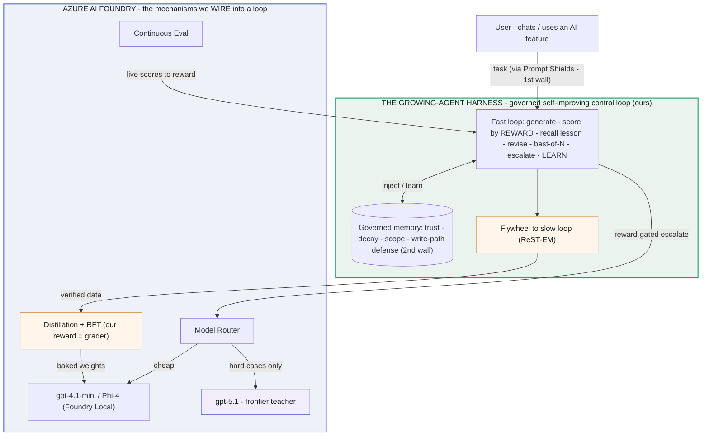

# Deck Source Pack — The Growing-Agent Harness (Team 6)

Everything needed to build the harness slides: the spoken story, all artifact links, and real example code for every part. Paste this into Claude and say *"create slides from this section."* All numbers are honest — measured live or by deterministic benchmark; nothing fabricated.

---

## 0. The one-liners (pick per slide)

**Positioning (the reframe — use these to open the harness section):**
- **"Not a layer beside Foundry — the governed, self-improving control loop that closes Foundry's *open* primitives (Model Router, Distillation, RFT, Continuous Eval, Memory) into a flywheel Azure ships the parts for but never assembles."**
- **"The self-improvement wedge for the whole Microsoft agent ecosystem — one MCP 'Coach' any Copilot Studio, MAF, or Foundry agent adds to start learning from its own usage."**

**Punchy:**
- **"Don't wait for a stronger model. Start compounding now."**
- **"The winner isn't who has the strongest AI — it's who starts learning first."**
- **"Ordinary usage is coal; the reward loop is the press; verified lessons are diamonds."**
- **"You write a reward, not a framework. Growing behavior is the free part."**
- **"The same free-data loop that makes the agent smarter also makes it yours."**
- **"We're not a MAF/Foundry alternative — we're the learning layer they leave open."**

---

## 1. The story (spoken narrative — 5 beats)

**Framing.** Two hackathon tracks: (1) build an AI product, (2) use AI efficiently. This is a **Track-2 efficiency** play, demonstrated on a deliberately huge domain — an **investor analyzer** — chosen as a stress test: *if a cheap model can compound here, it works anywhere.*

**Beat 1 — The ceiling.** "Here's the strongest AI today — Claude Fable 5 + skills — running the full flow on a huge domain. Watch how far it goes." (teammate's live demo)

**Beat 2 — The catch.** "Impressive, and expensive — and it starts every session from zero. And you're already waiting for the *next* model to be better."

**Beat 3 — The turn.** "Don't wait. The winner is whoever starts compounding first. We built a harness that makes even a *cheap* model a strong agent that gets better every time it's used — no GPU, no fine-tuning."

**Beat 4 — The diamond (the heart).** "The most expensive thing in AI is labeled data — normally you pay for user research and human labeling. We get it free: every time a user corrects a step, the reward labels a lesson. Our harness is the press that turns everyday usage — cheap as coal — into training data as valuable as diamonds. About 2.7 labeled examples per interaction, no labeling budget."

**Beat 5 — The honest close.** "I won't claim it's best for every case. But I'm certain of one thing: it compounds — and nothing else I've seen turns free usage into a permanent, growing asset. And where the data forced us to walk a claim back, we did — three times. What's left is what survived."

---

## 2. Artifacts (clickable deep-dives)

| Artifact | What it shows | Link |
|---|---|---|
| **Compounding curve** | context → weights: bare 60% → fast-loop 100% → baked 100% @ 0 ctx | https://claude.ai/code/artifact/4206a366-841e-4807-a97d-c92d972c62aa |
| **The evidence** | every claim, its number, measured vs mechanism vs live | https://claude.ai/code/artifact/1bea249e-a6df-438c-9187-7282c47edaf4 |
| **Coal → diamonds** | free training data: lessons + labeled examples mined, before→after | https://claude.ai/code/artifact/90a1b3e3-862a-4f99-8373-4e7fd7e98780 |
| **Story & full Q&A** | narrative, per-part implementation, mixed-audience Q&A, honesty ledger | https://claude.ai/code/artifact/470a3469-0514-4193-8195-ed30a55f93fd |
| **Architecture** | where the harness sits: our layer wrapping Foundry + MAF + LLM | https://claude.ai/code/artifact/a1c90c68-759f-4fc2-b969-79869e38f512 |
| **Repo** | all code + benches + docs | https://github.com/BuiDoanKhanhAnPrecioFishbone/team6-growing-agent-pattern |

### Architecture diagram (mermaid — renders directly in slides)
Our harness is a **learning layer** that wraps Azure AI Foundry + MS Agent Framework; the cheap model does the work, the frontier is called only on escalation, and the reward loop wires Foundry's separate boxes into one loop.



**We don't compete with Foundry — we close its open mechanisms into a loop:** Model Router → reward-gated escalate · Distillation/RFT ← the flywheel (our reward = the grader) · Agent Memory → *governed* memory · Prompt Shields (guards the prompt) + our write-path defense (guards what it learns). *One line: Foundry ships the parts — a router, a distiller, an evaluator, a memory store, a shield — but nobody assembles them into a self-improving loop. That governed loop is ours, callable from any MS agent via MCP / A2A.* See `docs/STANDOUT-IDEAS.md` for the full set of Azure integrations + bigger swings.

In-repo companions: `docs/STORY-AND-QA.md`, `docs/ADOPT.md`, `docs/COSMOS-MEMORY.md`, `docs/FOUNDRY-SETUP.md`, `scripts/run-evidence.ps1` (offline proofs), `scripts/run-live.ps1` (Foundry measurement).

---

## 3. How we built it — component by component, with code

> The harness is BCL-only, runs on Azure AI Foundry, inert offline. Everything below is a real snippet from the repo.

### 3.1 The contract — the only thing an adopter writes (`Harness.cs`)
```csharp
public interface IAgent
{
    string Id { get; }
    // produce a draft; learned lessons are injected; on a revision the prior draft + critique come back
    Task<string> GenerateAsync(AgentContext ctx, IReadOnlyList<Lesson> lessons,
        string? critique, string? priorDraft, int attempt, CancellationToken ct);
    Reward Evaluate(string draft, AgentContext ctx);      // THE REWARD — the real work
    Lesson? LessonFor(string trigger, AgentContext ctx);  // what to remember on a fixed mistake
}
```

### 3.2 The reward — one object, triple duty (`Harness.cs` + `Ergonomics.cs`)
```csharp
public sealed record Reward(bool Pass, double Score,
    IReadOnlyDictionary<string,double> Breakdown, IReadOnlySet<string> FailedTriggers, string Critique);

// a reward in three lines — each failed label becomes the lesson it teaches:
public Reward Evaluate(string draft, AgentContext ctx) => Checks.Of(
    ("cites a source",  draft.Contains("[")),
    ("states a call",   draft.Contains("BUY") || draft.Contains("SELL")),
    ("under 200 words", draft.Split(' ').Length <= 200));
```

### 3.3 The fast loop — improves within a run and run-to-run (`Harness.cs`, condensed)
```csharp
// retrieve a BOUNDED top-K of relevant lessons, capped by a token budget (never dump memory)
var injected = Context.FitLessons(
    await memory.RetrieveAsync(agent.Id, ctx.Features, opt.RetrieveTopK, ct), opt.LessonTokens);

for (var iter = 0; iter < opt.MaxIters; iter++) {
    // best-of-N: draw Samples drafts; the reward picks the winner (inference-time compute)
    for (var s = 0; s < opt.Samples; s++) {
        var draft = await agent.GenerateAsync(ctx, injected, critique, prior, seed, ct);
        var r = agent.Evaluate(draft, ctx);                 // reward gates + scores
        attempts.Add(new Attempt(draft, r.Score, r.Pass));  // ← the flywheel's training data
        if (roundBest is null || r.Score > roundBest.Score) { roundBest = r; roundBestDraft = draft; }
    }
    if (best.Pass && best.Score >= opt.Threshold) break;
    critique = roundBest.Critique; prior = roundBestDraft;  // revise, don't restart
}

// escalate to a stronger model ONLY if still below the bar (pay the premium on hard cases only)
if (escalate != null && !(best.Pass && best.Score >= opt.Threshold)) { /* one strong attempt, keep if higher */ }

// LEARN: for every mistake attempt-1 made that the loop then FIXED, mint a lesson
foreach (var trigger in firstReward.FailedTriggers.Except(best.FailedTriggers)) {
    var lesson = agent.LessonFor(trigger, ctx);
    lesson.Owner = Scope.Of(ctx.Features);                  // scope → personalization
    await memory.WriteAsync(lesson, ct);
}
```

### 3.4 Governed memory — retrieval + trust (`SemanticLessonStore.cs`)
```csharp
// RETRIEVE: metadata filter (agent · sector · scope · not-quarantined · active)
//   → embed the situation → cosine shortlist × recency × trust × importance × scope
//   → cheap-LLM "which of these apply?" rerank → two-phase load (only picked ids)

// PROMOTE with corroboration — a poisoned lesson can't self-promote by repeating ONE case:
var support = l.HelpedContexts.Count > 0 ? l.HelpedContexts.Count : l.TimesHelped;
if (l.Trust == Trust.Provisional && support >= 2 && l.HitRate >= 0.6) l.Trust = Trust.Verified;
```
Lifecycle also has: recency **decay**, capacity **eviction**, semantic **conflict**-demotion, cosine **dedup**-merge, hierarchical **consolidation** into meta-lessons, and **bi-temporal supersede** (tombstone, keep history) — see `Conflict.cs`, `Consolidation.cs`, `Importance.cs`.

### 3.5 Guardrails for learning — defend the WRITE path (`SemanticLessonStore.cs`, `MemoryAudit.cs`)
```csharp
// a learned lesson is UNTRUSTED text about to enter a prompt → screen it before it can be used
static readonly string[] InjectionMarkers =
    { "ignore previous", "disregard the above", "you are now", "system:", "<script", "javascript:", ... };

lesson.Trust = InjectionReason(lesson) is not null   // markers, or > 600 chars
    ? Trust.Quarantined                              // stored for audit, NEVER injected
    : lesson.Trust == Trust.Verified ? Trust.Verified : Trust.Provisional;

// second wall — a periodic post-hoc sweep re-screens everything and evicts dead provisionals
await MemoryAudit.RunAsync(store, agent);            // MemAudit-style defense-in-depth
```
This is the story judges remember: OWASP Agentic Top-10 lists persistent memory poisoning; MINJA-style attacks report >95% success against **input-only** guards. We defend the *write* path. `guardbench` runs 7 attacks, all fail (15/15).

### 3.6 Skill tier — reusable procedures, not just rules (`SkillExtractor.cs`)
```csharp
// ExpeL contrastive: distil the procedure a PASSING answer used that a FAILING one missed
var steps = await SkillExtractor.ContrastAsync(task, passDraft, failDraft);

// Voyager verify-gate: commit ONLY if following it reproduces a pass (library never fills with junk)
await SkillExtractor.CommitIfVerifiedAsync(store, agent, sector, situation, steps,
    provenance: "contrast on ACME",
    verify: (st, ct) => Task.FromResult(FollowingStepsPasses(st)));
// stored as LessonType.Procedure → inherits all memory governance for free
```

### 3.7 Slow loop — context → weights, then prune (`SlowLoop.cs`, `Training.cs`)
```csharp
// ReST-EM / rejection sampling: keep only PASSING trajectories, best per task (verified-gated)
IReadOnlyList<SftSample> sft = RestEm.Select(runs, threshold: 1.0);
File.WriteAllText("sft.jsonl", RestEm.ToChatJsonl(sft));   // real Azure Foundry fine-tune input

// after a bake: re-test each lesson on the baked model WITHOUT injection; evict what the weights absorbed
await Graduation.RunAsync(agent, store,
    scoreOnBakedWithoutLesson: (lesson, ct) => ScoreOnBaked(lesson),
    passThreshold: 1.0, evict: true, ct);
```
Verified-gated export is the documented antidote to **model collapse** (never train on unfiltered self-output).

### 3.8 Free data — put a number on it (`DataValue.cs`)
```csharp
var v = DataValue.Estimate(lessons, sftCount, prefCount, rlCount);
// v.VerifiedLessons · v.LabeledExamples · v.DollarsAvoided (at $/example, configurable)
//   "2 verified lessons · 8 labeled examples mined ≈ $1.60 of labeling avoided"
```

### 3.9 Personalization — one axis, two wins (`Scope.cs`)
```csharp
public static string Of(AgentFeatures f) =>            // where a lesson is written
    !string.IsNullOrEmpty(f.User)   ? $"user:{f.User}"     // personal (personalization)
  : !string.IsNullOrEmpty(f.Tenant) ? $"tenant:{f.Tenant}" // team
  :                                    "";                 // global (shared "diamond mine")
// retrieval merges global + tenant + user and ranks the MOST SPECIFIC first — no leakage, no cold start
```

### 3.10 Confidence & abstention — know when you don't know (`Confidence.cs`)
```csharp
Confidence c = ConfidencePolicy.Assess(outcome, threshold: 0.8, strongModelAvailable: hasStrong);
// c.Action ∈ { Answer, Verify, Escalate, Abstain }  — on uncharted ground it asks/escalates, never bluffs
```

### 3.11 Curriculum — directed practice (`Curriculum.cs`)
```csharp
var plan = Curriculum.Propose(lessons, recentRewards, top: 5);
// ranks: weak skills (checks failing most), unproven Provisional lessons, regressing Verified lessons
```

### 3.12 Learn from ordinary use — no teaching UI (`Implicit.cs`)
```csharp
// a user edits / thumbs-down / regenerates → the reward reads it → a Provisional lesson appears
var signal = new ImplicitSignal(SignalKind.Edit, task, aiOutput, correction: userEdit, features);
await ImplicitLearner.LearnAsync(signal, store, agent, ImplicitLearner.DefaultRuleDeriver());
```

### 3.13 Adoption — you write a reward, ~20 lines (`Ergonomics.cs`, `docs/ADOPT.md`)
```csharp
var harness = GrowingAgent.Quickstart("memory.json");  // JSON store + env options; Semantic/Cosmos/InMemory also fit
var outcome = await harness.RunAsync(new MyAgent(), ctx, GrowingAgent.Options(), ct);
```
Storage is a ~40-line `ILessonStore` seam (Json / Semantic / Cosmos / InMemory / your pgvector-Qdrant-AI-Search). Model is any OpenAI-compatible endpoint. Also shipped: a `apply-growing-agent` skill that wires the pattern into an existing repo.

---

## 4. The evidence (numbers for the slides)

**Measured live — gpt-4.1-mini vs gpt-5.1, 15 reasoning traps (`escbench`, `ablate`):**
| Result | Number |
|---|---|
| mini + harness + **escalate** vs frontier | **11/15 vs 10/15** (beats it), escalating only **6/15** |
| bare-mini + escalate = frontier quality | **10/15 at ~85%** of always-frontier cost |
| revise loop lifts the cheap model | **80% → 94%** (the workhorse lever) |

**Deterministic proofs — offline, self-verifying, one command (`run-evidence.ps1`):**
| Proof | Result | Bench |
|---|---|---|
| Compounding (context→weights) | bare 60% → 100% @ 0 ctx | slowloop |
| Memory poisoning defense | 15/15 attacks fail | guardbench |
| Skill transfer to unseen task | 0% → 100% | skillbench |
| Memory self-summarizes | 6 → 2 lessons | memcon |
| Memory lifecycle | 7/7 checks | memlife |
| Personalization, no leakage | 10/10 | personalize |
| Confidence / abstention | 4/4 | confbench |
| Curriculum | 5/5 | curriculum |
| Fast-loop compounding | 12 → 6 iterations | orchestrator |
| Flywheel export | SFT 5 · pref 5 · RL 10 | flywheel |

---

## 5. The honesty ledger (a slide of its own — it's the strongest asset)

| Claim | Status |
|---|---|
| mini+harness+escalate beats frontier (11 vs 10/15), escalate 6/15 | **Measured** (escbench) |
| bare-mini+escalate matches frontier at ~85% cost | **Measured** (escbench) |
| Revise loop lifts cheap model 80%→94% | **Measured** (ablate, 3 seeds) |
| Poisoning defense, skill transfer, consolidation, personalization, etc. | **Mechanism · deterministic**, CI-gated |
| Flywheel export + data-value count | **Real pipeline**; $ figure is an estimate |
| The compounding *bake* | **Mechanism demo** offline; export is real; one live fine-tune remaining |
| "It gets cheaper as it learns" | **Retired** — injected lessons add tokens |
| "Standalone harness ≈ frontier at a fraction of cost" | **Retired** — an efficient frontier beat best-of-N on both; the win is escalation routing |
| "Every amplifier lever adds quality" | **Retired** — only revise reliably lifts quality on the note task |

---

## 6. References mapped (for a "grounded in the field" slide)

| Our part | Prior art |
|---|---|
| Fast loop, lessons | Reflexion, Self-Refine, ExpeL, CRITIC |
| Skill/procedure tier | Voyager, Agent Workflow Memory |
| Memory (retrieval, importance, reflection, bi-temporal, conflict) | Generative Agents, Mem0, Zep/Graphiti, A-MEM, MemGPT, CoALA |
| Amplifiers (best-of-N, escalate) | Self-Consistency, Scaling Test-Time Compute (Snell) |
| Slow loop | STaR, ReST-EM, FireAct, GRPO, RULER/ART, RLVR |
| Guardrails / failure modes | OWASP Agentic Top-10, MINJA, model-collapse literature |
| **Ahead of the field** | trust lifecycle · write-path injection defense · verified-gated export · portable adoption |

---

## 7. Suggested slide breakdown (for Claude to structure)

1. **The turn** — don't wait for a stronger model; start compounding (Beat 2→3).
2. **How the harness works** — fast loop → governed memory → slow loop (§3.1–3.4, 3.7).
3. **What it learns & keeps safe** — learns (rules/skills/implicit) ‖ guardrails-for-learning (§3.5, 3.6, 3.10, 3.12).
4. **Coal → diamonds + personalized** — free data + scoped memory (§3.8, 3.9; diamonds artifact).
5. **The evidence — measured** — escalation + ablation ‖ 9 deterministic proofs (§4; evidence artifact).
6. **Findings + honesty ledger** — the measured findings + the 3 retired claims (§5).
7. *(optional)* **Grounded in the field** — the reference map (§6).
8. *(optional)* **Adopt it** — one reward, any model, any store; the skill (§3.13).

Design cues (from the artifacts, if you want visual consistency): green growth accent (#1f9d6b), clay for cost/data (#cf8a3b), monospace for headings/labels, green-biased neutrals, both light/dark.
